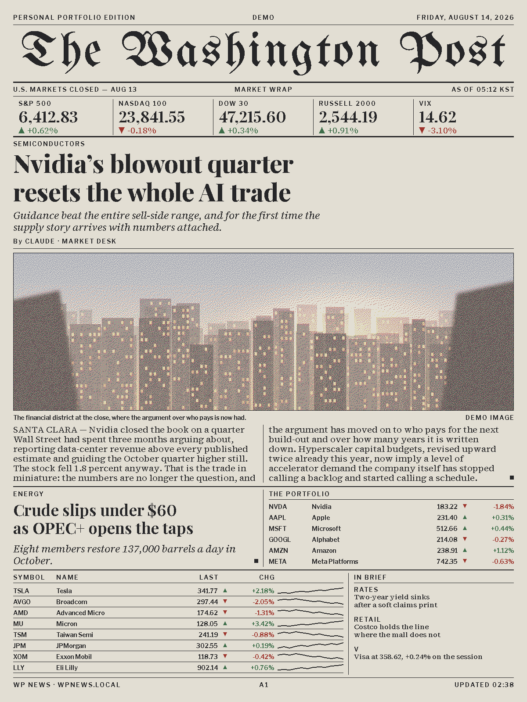
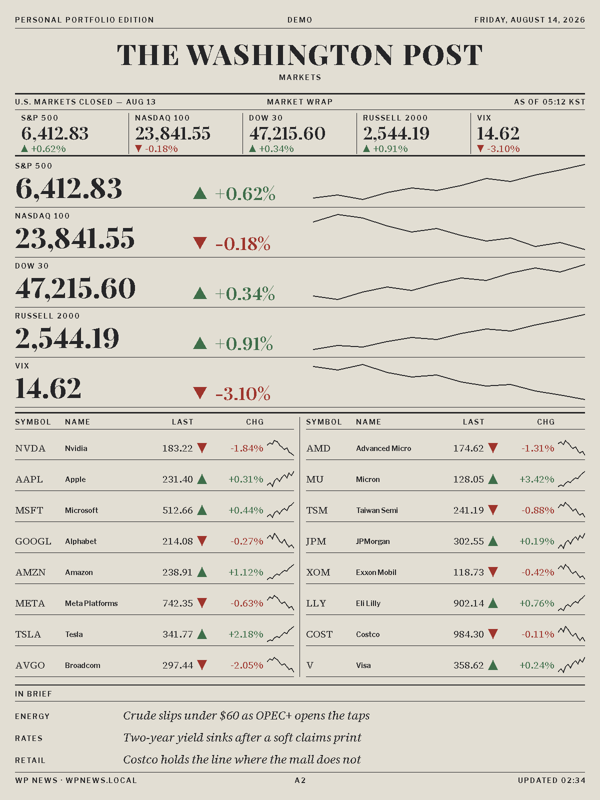

# The Claude Post

An ESP32-S3 driving a 13.3" six-colour e-Paper panel that prints a newspaper front page about the
stocks you name. A scheduled agent researches them twice a day and files one JSON file onto your
LAN; the board polls that URL and typesets it — portrait, 1200 × 1600, black type on white paper,
edge to edge.

<table>
<tr>
<td width="50%"></td>
<td width="50%"></td>
</tr>
</table>

Those are not mockups and they are not a preview. They are `sim/shots/01_a1_full.png` and
`02_a2_full.png`, written by `sim/sim.sh`, which builds the real page code on a real LVGL display
of the panel's own 1200 × 1600, pushes every flushed pixel through the same
`wp_quantize565()` the firmware's flush callback calls, and lands the result in a real 4 bpp
framebuffer — then asserts on those bytes. The previews are painted in the inks the panel really
has, not in the saturated primaries the UI draws with: a screenshot in primaries flatters the page
into a decision nobody could make from the glass. See [the simulator](docs/simulator.md).

Colour on that sheet is data, not decoration. It reaches exactly two things: a percentage change
with its ▲▼ mark, and a photograph. Blue and yellow never reach the glass from the UI at all, and
the simulator fails the build if they do — every exact palette colour takes `wp_quantize()`'s
identity path, so black type and 1 px hairlines come out crisp, and anything in between dithers.

**Point it at nothing and it still works.** With no URL configured the board draws a built-in demo
edition badged `DEMO` — one company, its stories, its dossier, its accounts and a photograph. That
is a complete configuration and a complete edition, not a placeholder.

## Quick start

```bash
. ~/esp/v5.4.3/esp-idf/export.sh    # once per shell

idf.py set-target esp32s3           # once per checkout
idf.py build
./tools/flash.sh                    # finds the port, flashes, monitors
```

Then join the `Claude Post-XXXX` Wi-Fi network the board raises and give it your Wi-Fi credentials
and, optionally, a page URL.

Doing this for the **first** time on a given board, follow [docs/bring-up.md](docs/bring-up.md)
instead. On this panel the three things most likely to be wrong on a first power-on all look
identical — a blank sheet — and the boot log is the only place they are told apart.

## Feeding it

There is no server-side application. The producer is an agent with a market-data connection and a
directory, and the whole contract between it and the firmware is one JSON file plus some tiles:

```bash
./agent/standalone/file-edition.sh --serve
```

That wakes Claude Code headless with the standing instructions in
[`tools/edition/PROMPT.md`](tools/edition/PROMPT.md) — a market desk that has to fit a broadsheet
front page — pulls quotes and bars over the Alpaca MCP, writes `~/.claudepost/edition/news.json`
atomically, validates it against the contract, and serves the directory on `:8123`. Install the two
launchd agents next to it and the paper files at 06:00 and 22:00 KST: the first moment a complete
US session exists to report on, and half an hour before the next open.

Twice a day, not more, and that is arithmetic rather than restraint — see below.

Point the board at whatever serves it, from the portal or over the network:

```bash
curl -X POST http://claudepost.local/api/news \
     -d '{"url":"http://mymac.local:8123/news.json"}'
```

Anything that serves that JSON works; the device cannot tell what wrote it. The format is
[documented and tested](docs/news-contract.md), and the reference producer is a runnable file:

```bash
python3 tools/mock_news_server.py            # serve the canonical payload on :8123
python3 tools/mock_news_server.py --live     # ... and nudge the prices every request
python3 tools/mock_news_server.py --validate ~/.claudepost/edition/news.json
```

`--validate` is the one that saves a cycle. It checks what the device checks, plus the length
budget the device *cannot* check — headlines and decks are ellipsized at a fixed height rather than
reflowed, so a lead headline over 72 characters does not come back shorter, it comes back with a
`…` in the middle of a sentence — plus that every character is drawable by the bundled faces, and
that every `photo.id` has a tile of exactly `w × h / 2` bytes.

Photographs are made by `tools/make_tile.py`, which diffuses them across all six inks — `--halftone`
opts back into black ink on white paper:

```bash
python3 tools/make_tile.py photo.jpg -o "$EDITION_DIR/tiles/lead.bin" \
        -W 1140 -H 320 --halftone --preview /tmp/check.png
```

That was rendered both ways and looked at. Error-diffusing a photograph across Spectra 6's real
primaries — a brick red `#62201E`, a moss green `#35563A`, a navy `#233F8E` — produces coloured
speckle that reads as damage. The same image halftoned to one ink reads as print, which is what a
broadsheet actually does with a photograph, and the panel's black `#1F2226` on its white `#B9C7C9`
is exactly that pairing. `--color` is still there for an image that is *about* its colour; nothing
on the front page uses it.

The device does no image work at all. It fetches `w × h / 2` raw bytes at 4 bpp in the
framebuffer's own nibble order and blits them a row at a time.

## Verify before claiming anything works

Four layers, three of which need no hardware. Each is faster than the next and catches a different
class of mistake.

```bash
# 1) pure logic — eight tests: the wire format, the demo front page against the
#    producer's committed fixture, the fetch layer, the companion-app JSON, the
#    framebuffer -> dual-controller repack, the quantizer, copyfit, chart scaling
cmake -S components/news_core/test/host -B /tmp/vt && cmake --build /tmp/vt
(cd /tmp/vt && ctest --output-on-failure)

# 2) provisioning pure logic, and the producer against that same fixture
sh components/provisioning/test/run.sh
python3 tools/mock_news_server.py --check

# 3) the real UI at 1200x1600 in six inks -> BMP + PNG, and the assertions
cd sim && ./sim.sh          # NEWS_URL=http://localhost:8123/news.json ./sim.sh

# 4) firmware
idf.py build
```

The simulator is a test. It fails the build on a missing glyph, on a rule that breaks anywhere
along its row, on ink outside the 30 px margin, on a band that rendered nothing, on a label printed
over another, on the masthead measuring more than 1140 px, and on any red or green pixel outside
the slots §6 of the design spec allows to carry it. Look at `sim/shots/*.png` after any UI change —
ten sheets, both pages across a full payload, a one-story payload and a day that brought no stories
at all, then the STALE and OFFLINE badges, the provisioning overlay, and the sheet before the first
snapshot lands.

## Hardware

| Item | Specification |
|------|------|
| Board | **Seeed XIAO ePaper Display Board** (EE02 carrier) + **XIAO ESP32-S3 Plus** |
| SoC | ESP32-S3 (Xtensa LX7 dual-core), 16 MB Flash / 8 MB Octal PSRAM |
| Display | 13.3" **Spectra 6** e-Paper, **1200 × 1600 portrait**, six inks, 4 bpp |
| Controllers | **two UC8179s**, one SPI bus, two chip selects |
| Refresh | 25–30 s, full sheet only — Spectra 6 has no partial waveform |
| RTC | none — the clock is SNTP only |
| Buttons | KEY0/1/2 (GPIO2/3/5) on the carrier, BOOT (GPIO0) on the XIAO |
| Power | 5 V USB-C, optional Li-ion (JST 2.0 + slide switch) |

The framebuffer is the panel's own portrait 1200 × 1600 at 4 bpp — stride 600, **960,000 bytes**,
two pixels per byte with even x in the high nibble. An earlier revision presented the panel as
landscape and rotated while packing; going portrait *removed* the rotation rather than inverting
it, and the pack collapsed to a per-row 300-byte `memcpy`. The derivation is preserved
byte-for-byte in `epd6_transpose.h`, because that is the only form in which "the page did not turn
over" is checkable.

That move also took the plane split from rows to **columns**: the master UC8179 owns x 0…599 and
the slave owns x 600…1199. So a slave that never answers is now the **right half of the sheet
blank**, not the bottom half — which is the first symptom to recognise, because the second chip
select is GPIO41 and it appears in no Seeed document. It comes from
[`acegallagher/esphome-bigink`](https://github.com/acegallagher/esphome-bigink), the only published
source that drives this panel without Seeed's cloud tooling.

Three traps, all of which fail silently:

**BUSY is active LOW.** The panel is idle when the pin is HIGH. Backwards, every wait returns
instantly, the driver writes into a controller mid-refresh, and the sheet comes out torn with
nothing in the log to say why. **GPIO43 gates the panel's power** through a load switch that is
pulled down, so the panel is unpowered until it is driven HIGH. And **GPIO43/44 are the default
UART0 pins**, so the console must stay on USB Serial/JTAG — a UART0 console clocks log bytes
straight into the panel's power-enable and chip-select lines. See [docs/pinout.md](docs/pinout.md).

## Controls

| | |
|---|---|
| KEY0 | toggle A1 / A2 |
| KEY1 | poll the page source now |
| KEY2 | tap → A1 · **hold 5 s → reboot into Wi-Fi setup** |
| BOOT | the other page |

A page change always spends a full refresh, because there is no cheaper kind. KEY1 spends one only
if the poll comes back with something different on it.

## The thing that makes this board different

**A refresh takes twenty-five to thirty seconds and flashes the whole sheet.** Spectra 6 has no
partial waveform, so there is no cheap update to fall back on: every partial-refresh entry point
from the 5.83" monochrome driver this replaced is *gone* rather than stubbed, and a caller that
wants one fails to compile instead of quietly spending half a minute.

Drawing and presenting are therefore separate everywhere, and exactly one task (`UiTask` in
`components/user_app/user_app.cpp`) touches LVGL or starts a refresh. Everything else — buttons,
the HTTP API, the poller — posts a command and returns.

```c
...update widgets...      /* ui_news_set_*(), cheap, no panel traffic */
Lvgl_RenderNow();         /* synchronous render -> flush_cb -> framebuffer */
epd6_refresh();           /* twenty-five to thirty seconds. Not free. */
```

And the rule the whole application is arranged around: **a poll that changes nothing must not touch
the panel.** The board polls every five minutes — 288 times a day — and the desk files twice.
Without a fingerprint that is 286 refreshes shown to nobody, about two hours a day of a wall
flashing to display the page it was already displaying.

`news_hash()` is what makes it true. It fingerprints everything that reaches the glass, down to the
photo ids, the chart span and every individual bar, and `NewsTask` compares before it notifies
`UiTask`. A fingerprint that is too narrow does not fail loudly — it shows yesterday's paper
forever, and nobody notices until they read a stale number off it.

Comparing them is cheap because a snapshot is a plain copyable value with fixed capacities and no
pointers: one page, one struct, safe to snapshot under a mutex and hand to another task with no
ownership question. It is also 24,328 bytes measured, against `NewsTask`'s 16 KB stack — so both
producers work off the heap or write the caller's storage directly, and neither ever puts a whole
edition on a frame.

The clock is on the same footing, and it is the reason nothing on the sheet ticks. On the 5.83" the
header was worth a windowed partial every five minutes; here a tick that changes one pixel costs the
same twenty-five seconds as new data. So `ui_news_tick()` moves the date on **in the framebuffer**
and rides out with the next refresh that had a reason of its own. It never earns one.

That is also why the only clock-derived thing left on the paper is the dateline, and only on a board
whose payload did not spell one itself. `as_of` on the tape says when the numbers are from, which is
the server's claim and the honest one; a second time at the foot saying when the glass last
repainted would be a machine's concern printed on a reader's page. A newspaper carries a date, not a
clock.

## The page

The grid is a 30 px margin on all four sides, then six columns of 170 with a 24 px gutter
(6·170 + 5·24 = 1140). Spans are 364 at two columns, 558 at three, 1140 at six.

**Every span and every origin is even, and that is a requirement rather than an aesthetic.** A
photo tile packs two pixels per byte, so a tile that is an odd width — or that starts at an odd x —
cannot be blitted as a per-row `memcpy` and needs a nibble-shifting slow path on the device for no
reason at all. An even column and an even gutter make every span and every origin even.

The measures are read out of the committed font files, not estimated: `body_16` at two columns is
364 px and sets 42 characters; `body_20` at three columns is 558 px and sets 53. They are not the
same width, which was the first guess and was wrong — `body_20` at two columns sets 34 characters,
which is a caption measure, not a reading measure.

Seven faces from four families, all SIL OFL 1.1 and all **1 bpp**: UnifrakturMaguntia for the
masthead, Playfair Display for headlines, Source Serif 4 for decks and body, Libre Franklin for
kickers and labels. 1 bpp is a measurement, not a default — anti-aliased text goes through the same
ordered dither as a photograph and comes out with holes punched through `m`, `w` and every
descender. The masthead reads `S_MASTHEAD` in `ui_strings.h`; its face carries all of A–Z, a–z and
`.,'-&` rather than only the letters that string happens to use, so renaming the paper cannot
silently blank the largest text on the sheet.

The nameplate carries a **mark** beside the name, and it is geometry rather than an asset: eleven
wedges from a common centre, a baked table of integer vertices filled as exact scanline spans. At
61 px its rays are two and three pixels wide — the same order as a halftone's own dot — so a screened
tile would print them as dotted lines, where spans put down exactly the ink that was asked for.

The compositor, the copyfitter and the length budget are in [docs/pages.md](docs/pages.md) and, in
full, in [the design spec](docs/specs/2026-08-15-single-company-broadsheet-design.md).

## Project structure

```
main/                     app_main: panel + LVGL bring-up, provisioning, task launch
components/
  port_bsp/               the 13.3" port — the only code that talks to the panel
    epd6_panel.c          dual-UC8179 driver: two chip selects, no partial refresh
    epd6_transpose.c      framebuffer -> controller repack, and its derivation
  app_bsp/                LVGL port (RGB565 draw buffers, quantized in the flush callback)
  news_core/              the portable core — identical on device, sim and host tests
    news_model.c          the snapshot struct, a UTF-8-safe copy, a content fingerprint
    news_parse.c          the wire contract, clamping every field
    news_mock.c           the built-in demo front page
    news_service.c        one fetch: http_get + parse
    ui_compose.c          the make-up desk: guillotine cuts, packing, height, tombstoning
    ui_modules.c          the module renderers both pages are built from
    ui_news.c             the two pages and the routing between them
    ui_page_front.c       A1 — the day's modules: the lead, the stories, the dossier rail
    ui_page_markets.c     A2 — the same company's accounts, composed the same way
    ui_fit.c              copyfit: as much text as fits, cut at a word boundary
    ui_chart.c            line / candle / bar, integer scaling, no libm
    ui_tile.c             fetch and blit a 4bpp photo tile
    ui_common.c           the shared shapes; ui_internal.h holds the grid and the furniture
    wp_palette.c          the six-ink quantizer, shared with the simulator
    device_api_json.c     the JSON the companion app receives
    fonts/                seven newspaper faces (OFL) — generated, do not hand-edit
    test/host/            the nine host tests
  provisioning/           SoftAP + captive portal + NVS + SNTP onboarding
  device_api/             STA-mode HTTP/JSON control server + mDNS (claudepost.local)
  board_io/               battery ADC
  buttons/                KEY0/1/2 + BOOT edge events
sim/                      desktop simulator — the real UI at 1200x1600, and its assertions
tools/
  edition/                the typesetting gate: PROMPT.md, render-check.sh
  mock_news_server.py     the reference producer, the fixture writer, --check and --validate
  make_tile.py            a photograph -> a 4bpp Spectra 6 tile
  gen_fonts.py            regenerates components/news_core/fonts/
  flash.sh                find the board and flash it
server/                   the desk: command queue, directives, gates, editions, and the URL the board polls
agent/                    an example worker that files into the desk, plus the standalone no-server producer
app/                      React Native companion app — setup + control over the LAN
third_party/cJSON/        vendored (ESP-IDF v6 dropped cJSON from core)
```

## Documentation

- [docs/bring-up.md](docs/bring-up.md) — first power-on: reading the boot log, and the numbers to record
- [docs/news-contract.md](docs/news-contract.md) — the JSON the device polls, and how it fails
- [docs/desk-server.md](docs/desk-server.md) — the always-on desk: the command queue, the schedule, and the typesetting gate run before every candidate page
- [docs/pages.md](docs/pages.md) — the two pages, the layout grid, and the font decision
- [docs/epaper-13in3.md](docs/epaper-13in3.md) — the panel driver, the refresh policy, the self-test
- [docs/pinout.md](docs/pinout.md) — GPIO assignments and the three traps
- [docs/board-hardware.md](docs/board-hardware.md) — hardware notes
- [docs/app-control.md](docs/app-control.md) — the HTTP/JSON control contract
- [docs/simulator.md](docs/simulator.md) — the desktop simulator, and what it asserts
- [docs/graphics.md](docs/graphics.md) — six-ink rendering notes
- [docs/esp-idf-development.md](docs/esp-idf-development.md) — install / build / flash / menuconfig
- [docs/references.md](docs/references.md) — datasheets and upstream sources
- [docs/specs/](docs/specs/) — the design this was built from, including what was deliberately deferred

## Lineage

Forked from `saju_omi_esp32`, a 2.13" fortune-slip board on an EE05, by way of a 5.83" monochrome
dashboard. What survived both moves is the structure — the draw-and-present split, the
captive-portal provisioning, the device API, the simulator, and the habit of writing a host test
before believing anything. What did not survive is every line of content code, twice.

It deliberately keeps neither ancestor's mDNS name nor AP prefix: the hostname is `claudepost` and
the AP is `Claude Post-XXXX`, not the `tickerboard` / `Ticker Board` whose shipped app still
resolves those names. Two devices answering one discovery probe on the same LAN is a fault nobody
can diagnose.

## License

MIT — see [LICENSE](LICENSE). The bundled faces are four families under SIL Open Font License 1.1:
Libre Franklin, Playfair Display, Source Serif 4 and UnifrakturMaguntia
(`components/news_core/fonts/OFL-*.txt`).
